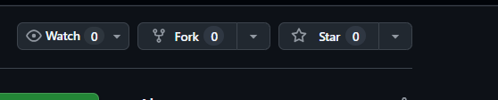
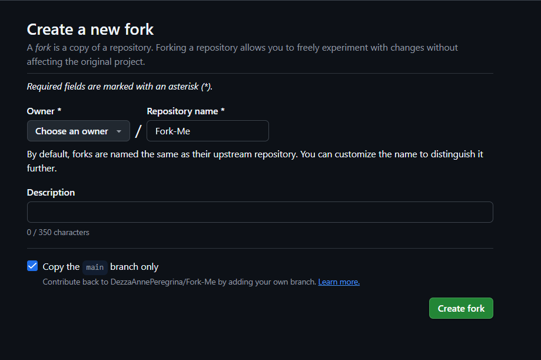
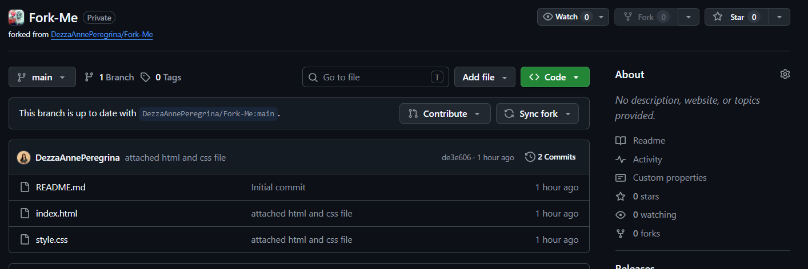
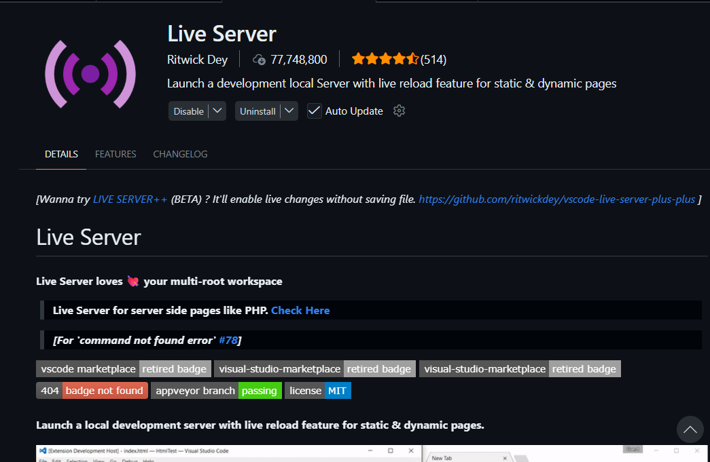
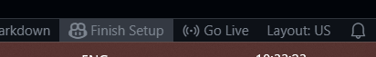
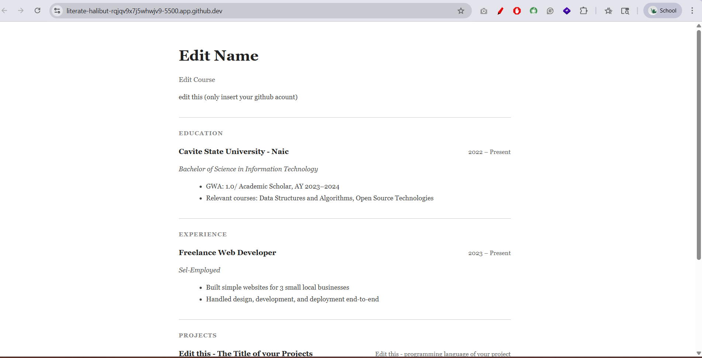

# Laboratory Activity: Fork and Edit a Resume Website using GitHub Codespaces

## Objective

This activity will help you practice how to Fork a repository.

---

# Instructions

## Step 1: Fork the Repository

1. Open this repository - https://github.com/DezzaAnnePeregrina/Fork-Me
2. Click the **Fork** button located at the top-right corner of the repository page.


3. Wait for GitHub to create a copy of the repository under your GitHub account.


---

## Step 2: Open the Repository in GitHub Codespaces

1. Open your forked repository.
2. Click the green **Code** button.
3. Select the **Codespaces** tab.
4. Click **Create codespace on main**.
5. Wait for GitHub Codespaces to fully load.

---

## Step 3: Install Live Server

1. Inside Codespaces, click the **Extensions** icon on the left sidebar.
2. Search for:
Live Server
3. Install the extension.


---

## Step 4: Run the Project using Live Server

1. Open the `index.html` file.
2. Right-click the file.
3. Click **Open with Live Server**.

4. A browser preview of the website should appear.


---

# Required Modifications

You must edit the following sections of the resume website:

## Personal Information

- Replace `Edit Name` with your full name.
- Replace `Edit Course` with your course, year, and section.
- Replace the GitHub placeholder text with your GitHub username or profile link.

---

## Projects Section

You must:

- Replace the project titles
- Replace the programming language/technology used
- Replace the project descriptions

---

## Step 5: Save the Changes

Save all modified files.

Shortcut: Ctrl + S

---

## Step 6: Commit and Push Your Changes

Open the terminal in Codespaces and run the following commands:

### Add the files

```bash
git add .
```

### Commit the changes

```bash
git commit -m "message"
```

Example commit Message:

```bash
git commit -m "Peregrina - Updated resume website"
```

### Push the changes

```bash
git push
```

---

# Final Output

Submit a PDF file containing the following screenshots:

1. Screenshot of the forked repository
2. Screenshot showing Live Server running
3. Screenshot of the modified HTML file
4. Screenshot of the updated webpage output
5. Screenshot of the GitHub repository after pushing the changes

Also include your GitHub repository link in the PDF submission.

---

# Reminder

- Make sure your output is personalized.
- Do not leave placeholder texts such as:
  - `Edit Name`
  - `Edit Course`
  - `Edit this`
- Ensure your pushed repository contains your updated files.